## Quarto

Quarto enables you to weave together content and executable code into a finished presentation. To learn more about Quarto presentations see <https://quarto.org/docs/presentations/>.

## Bullets

When you click the **Render** button a document will be generated that includes:

-   Content authored with markdown
-   Output from executable code

## Code

When you click the **Render** button a presentation will be generated that includes both content and the output of embedded code. You can embed code like this:

```{r}
1 + 1
```

## Barplot of cell type for each sample

::::: columns
::: {.column width="50%"}
my nucleus segmentation 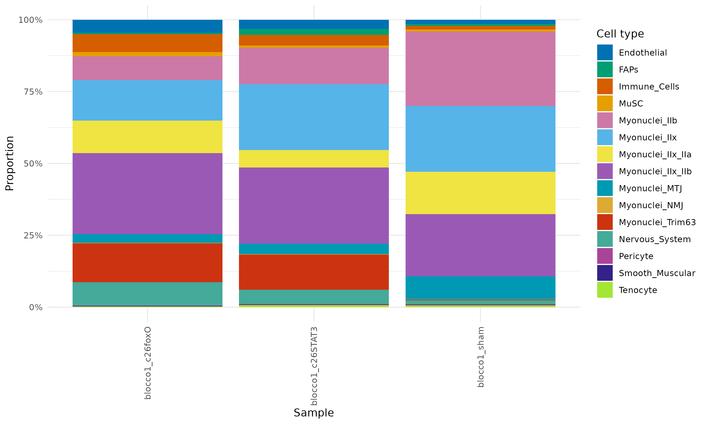{.absolute top="210" left="0" width="500" height="250"}
:::

::: {.column width="50%"}
SpaceRanger segmentation 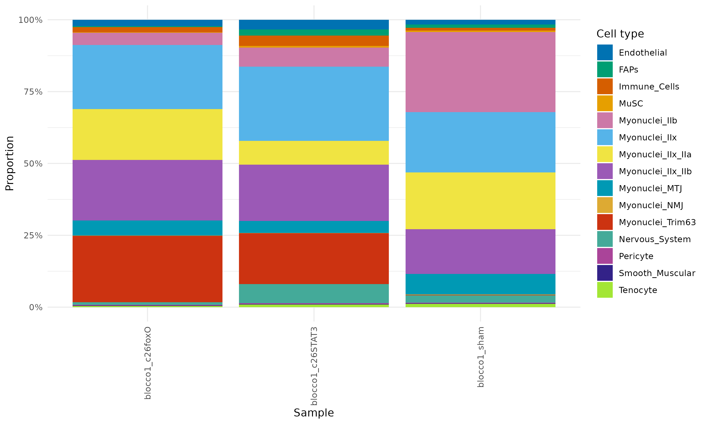{.absolute top="210" right="0" width="500" height="250"}
:::
:::::

## Barplot of proportion for each cell type

::::: columns
::: {.column width="50%"}
my nucleus segmentation 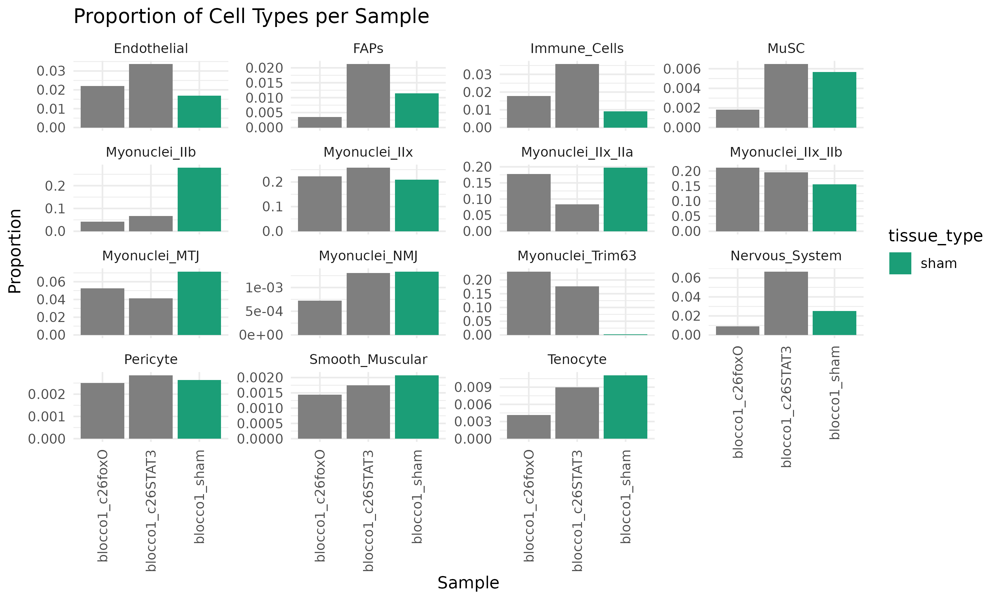{.absolute top="210" left="0" width="500" height="250"}
:::

::: {.column width="50%"}
SpaceRanger segmentation 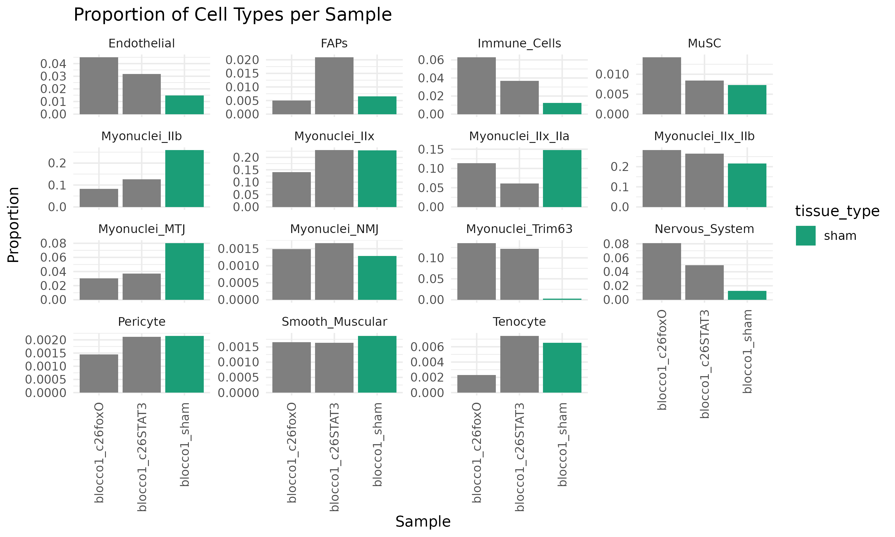{.absolute top="210" right="0" width="500" height="250"}
:::
:::::

## 2 columns, 2 tabsets

::::::: columns
:::: {.column width="50%"}
::: panel-tabset
### IIx_IIb

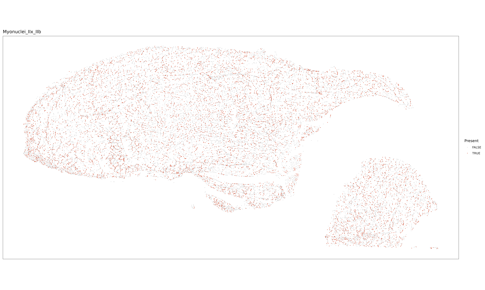{.r-stretch}

### IIb

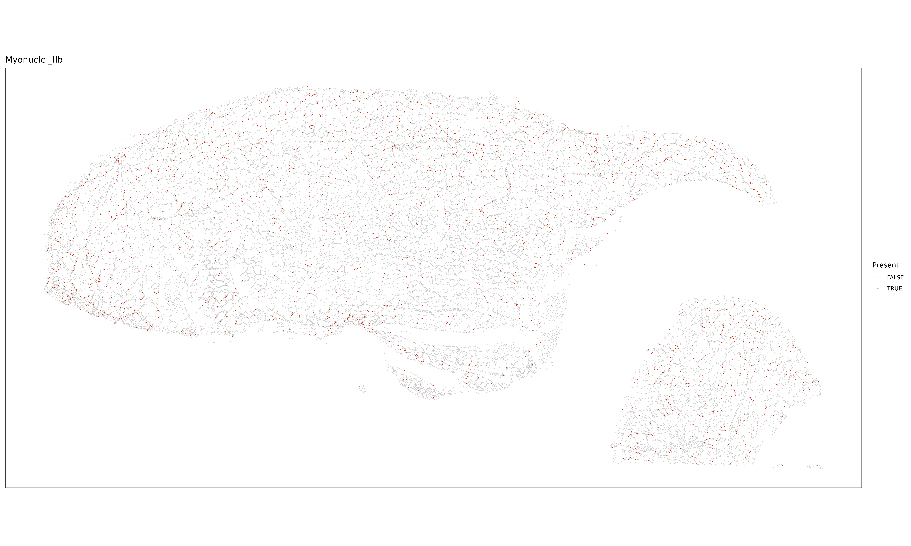{width="100%"}

### IIx

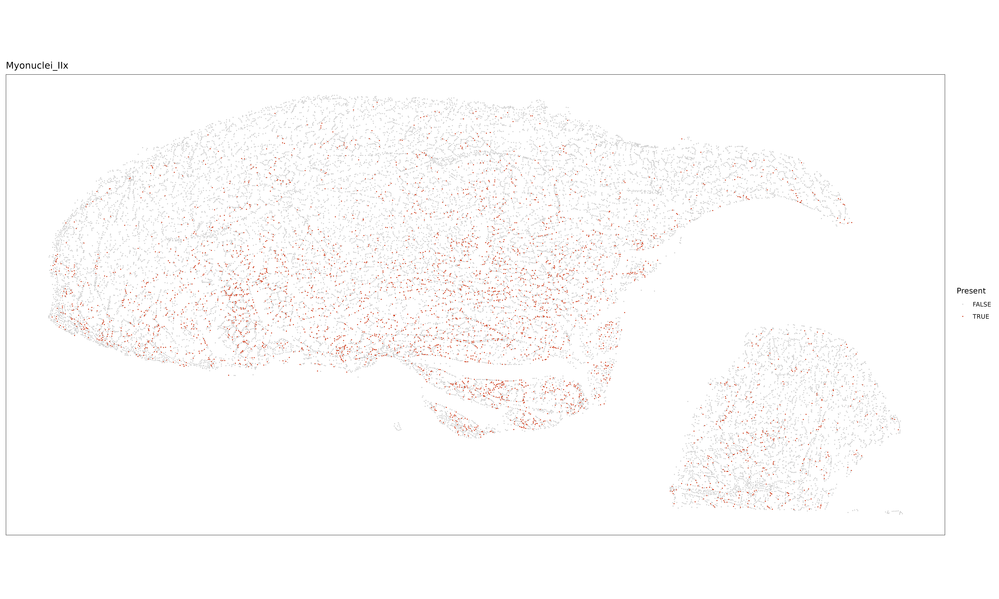{width="100%"}

### IIx_IIa

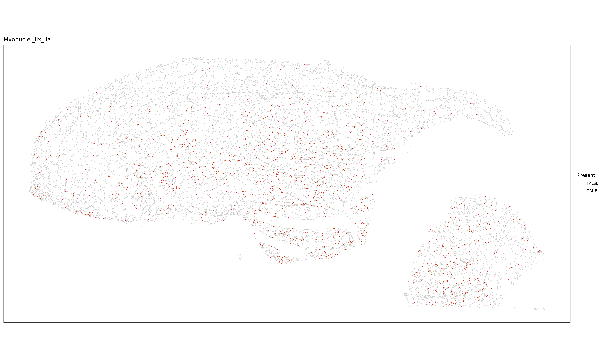{width="100%"}
:::
::::

:::: {.column width="50%"}
::: panel-tabset
### IIx_IIb

 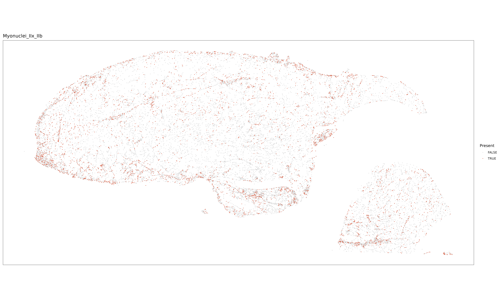{.r-stretch}

### IIb

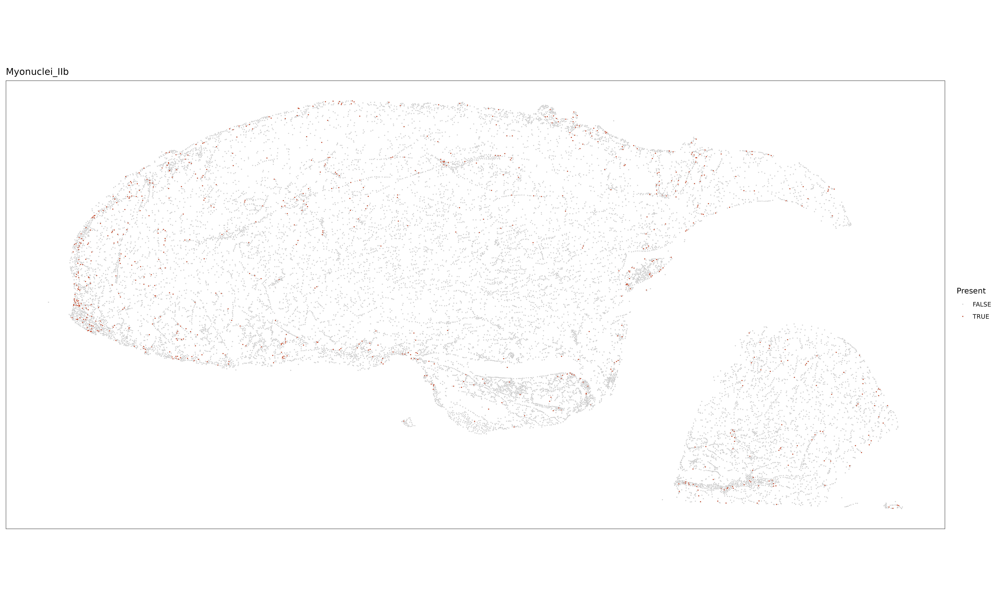{width="100%"}

### IIx

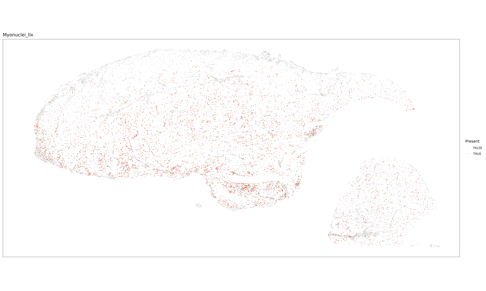{width="100%"}

### IIx_IIa

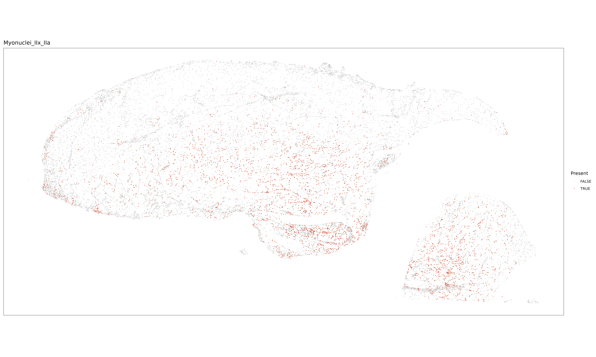{width="100%"}
:::
::::
:::::::
